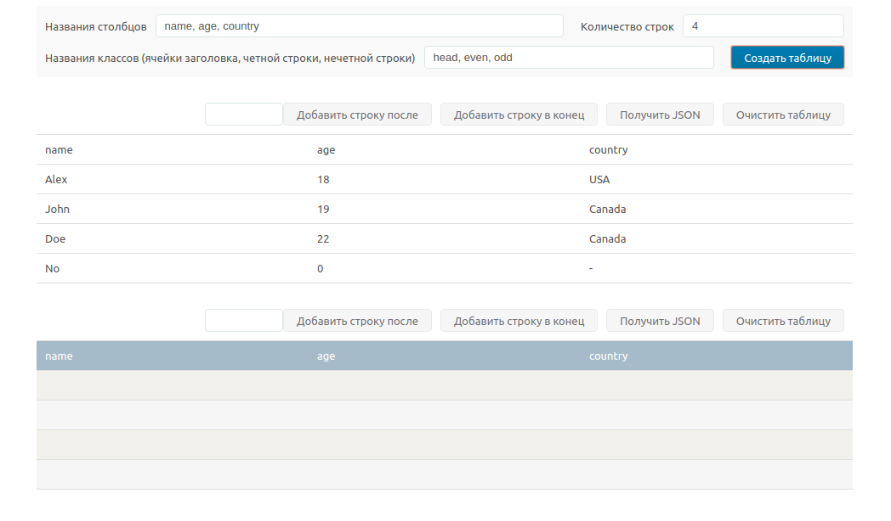

# Конструктор таблицы

Реализация конструктора таблицы, принимающего три параметра: `список заголовков`,
`количество строк`, `css-классы`. Дополнительные методы:
- вставка строки после переданного параметра;
- вставка строки в конец таблицы;
- получение json объекта из таблицы в буфер;
- очистка таблицы;

Был использован следующий стэк:
ES6+;
Postcss;

p.s: тестовое задание, передача конфига с опциями в конструктор не требовалась.

[посмотреть демо](https://mendagazievb.github.io/table/)